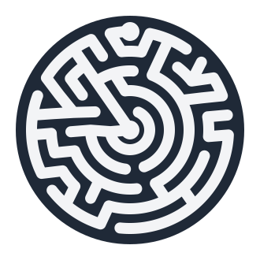
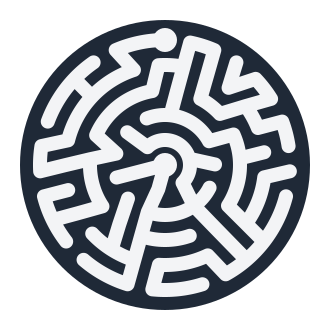

# Final Maze Designs

Production-ready maze designs for laser cutting. Each maze corresponds to an acrylic color.

## Maze Gallery

| Preview | Color | Seed | File |
|---------|-------|------|------|
|  | Light Blue | 38763 | `orbital_maze_290mm_seed38763_lt_blue.svg` |
|  | Blue | 41046 | `orbital_maze_290mm_seed41046_blue.svg` |
|  | Orange | 50705 | `orbital_maze_290mm_seed50705_orange.svg` |
|  | Red | 50937 | `orbital_maze_290mm_seed50937_red.svg` |
|  | Green | 74900 | `orbital_maze_290mm_seed74900_green.svg` |
|  | Pink | 83544 | `orbital_maze_290mm_seed83544_pink.svg` |

## Cut Specifications

- **Diameter**: 290mm
- **Puck Size**: 14mm
- **Min Wall**: 11mm
